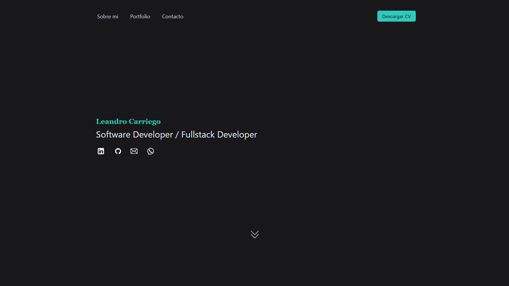
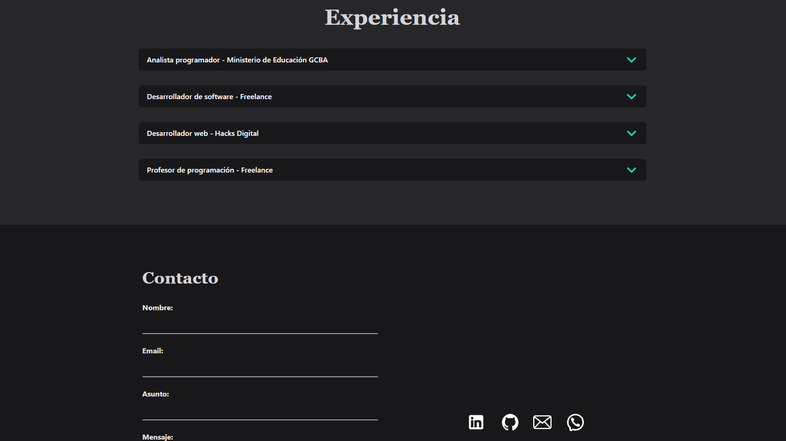
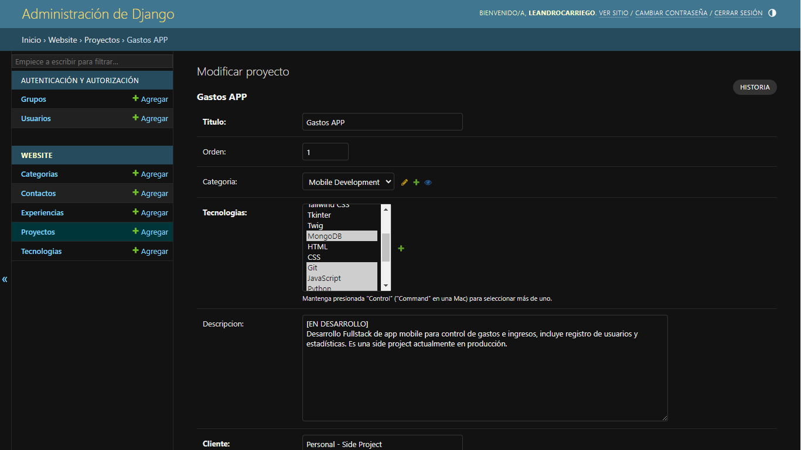

# PORTFOLIO 
## DJANGO - TAILWIND CSS - POSTGRESQL






Este es mi porfolio personal, desarrollado con el modelo MVT de Django, puesto en produccion en [Render](https://render.com/)

[VER PORTFOLIO](https://portfolio-leandro-carriego.site/)

### Clonar y Ejecutar Proyecto

Sigue los siguientes pasos para clonar y ejecutar este proyecto en tu entorno local.

### Requisitos previos

1. [Python](https://www.python.org/) - Asegúrate de tener Python instalado, que incluye pip para administrar las dependencias del proyecto.
   
2. Virtual Environment - Ejecuta el siguiente comando para instalarlo
   
   ```python data-copyable
    pip install virtualenv

3. [PostgreSQL](https://www.postgresql.org/) - Necesitarás esta base datos.

4. [Git](https://git-scm.com/) - Necesitarás Git para clonar el repositorio.

## Pasos para clonar y ejecutar el proyecto

1. **Clonar el repositorio:**
   Abre tu terminal (o línea de comandos) y ejecuta el siguiente comando para clonar el proyecto desde GitHub:

   ```bash data-copyable
    git clone https://github.com/leandrocarriego/portfolio_personal-django.git

2. **Prepara tu entorno virtual** 
  
   ```python data-copyable
    python -m venv venv

3. **Instalar dependencias:**
    
    ```python data-copyable
    pip install -r requirements.txt

4. **Configura tu base de datos PostgreSQL**

5. **Configurar archivo .env:**
   Crea un archivo .env y copia el contenido del archivo .env.example, completa las variables de entorno.
   Setea DEBUG=True.

6. **Realiza las migraciones en tu base de datos:**

    ```python data-copyable
    python manage.py makemigrations
    python manage.py migrate

6. **Inicia Tailwind CSS:**

    ```bash data-copyable
    python manage.py tailwind start

6. **Iniciar el servidor de desarrollo:**

    ```bash data-copyable
    python manage.py runserver

# portfolio_personal_django
